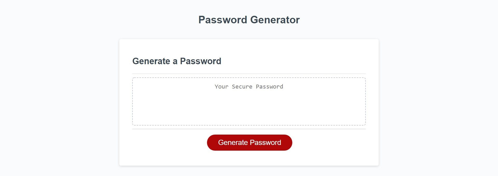
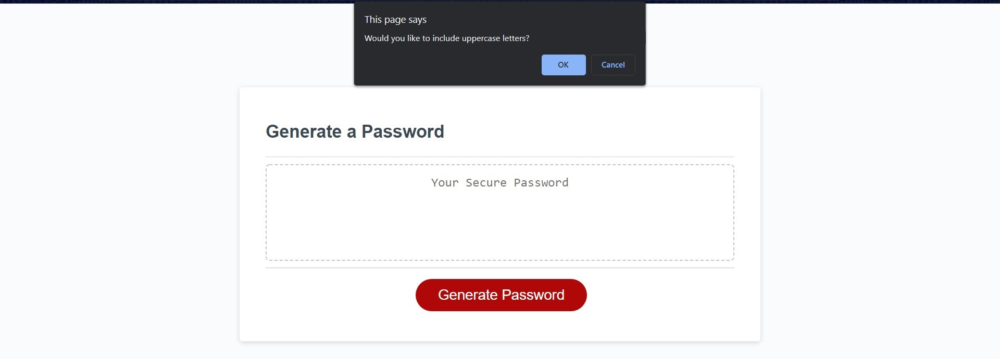
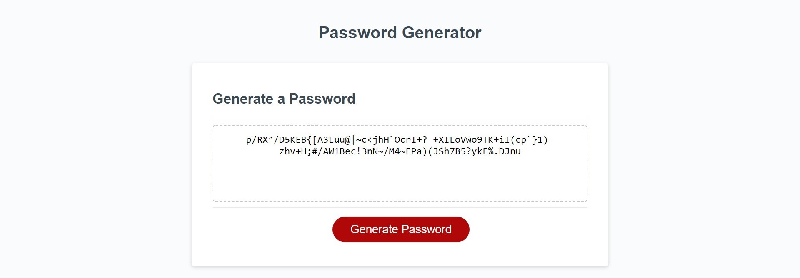

# Password Generator

## About

This program is a password generator meant to create a safe and secure password based on the user's desired password length and criteria. Short and simple passwords are easy to guess which means greater chances of getting hacked. This is a big problem, especially if someone manages to guess your password and access important account information. 

Nowadays, all websites encourage users to think of a strong, hard-to-guess, and unique password to guarantee a better chance of their accounts being safe. This password generator does just that. Users can generate randomly generated passwords from a set of characters that fit any criteria they want. Being able to have multiple unique passwords that are not easily hackable and guessed is a much safer option.

## How to Use

To use the program, the user can click the "Generate" button in the middle of the page to start the generator.

A series of prompts will then show up on the user's browser asking for criteria.

First, the program asks for password length. Numbers from 8 to 128 (inclusive) will be passing, while anything lower or higher than that will be rejected. A safe password should be at least 8 characters after all! The user can also cancel the input, in which case, the program will stop prompting.

Next, there will be confirm alerts asking the user for the characters they want their password to have:
* Lowercase Letters (a, b, c, d, etc.)
* Uppercase Letters (A, B, C, D, etc.)
* Numbers (1, 2, 3, 4, etc.)
* Special Characters (!, ?, *, @, etc.)

The user can say Confirm or Cancel to each of these prompts. If at least one is confirmed, the password will generate based on the chosen criteria. If the user says no to all four prompts, an error message will display and the prompts will restart from the beginning. You can't have a password with no characters!

Finally, once the password has been randomly generated by the computer, it will display it in the text box in the center. From there, the user can choose to generate a new one, or copy the password from the text box.

## Link

Link to the GitHub repository: https://github.com/cindyung56/password-generator

Link to page: https://cindyung56.github.io/password-generator/

## Resources

Here is a list of resources used to solve some of the problems I ran into while doing this project:

* [How to use parseInt()](https://developer.mozilla.org/en-US/docs/Web/JavaScript/Reference/Global_Objects/parseInt)

* [How to use window.alert()](https://developer.mozilla.org/en-US/docs/Web/API/Window/alert)

* [How to use window.confirm()](https://developer.mozilla.org/en-US/docs/Web/API/Window/confirm)

* [How to use window.prompt()](https://developer.mozilla.org/en-US/docs/Web/API/Window/prompt)

*[Count the number of characters in a word, phrase or sentence](https://wordcounter.net/character-count)